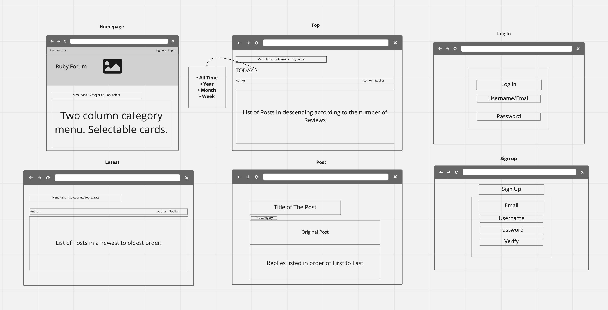
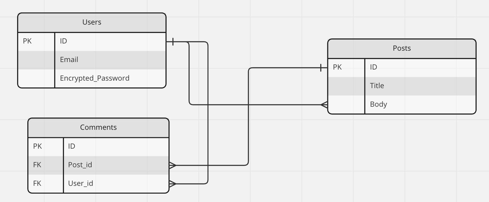
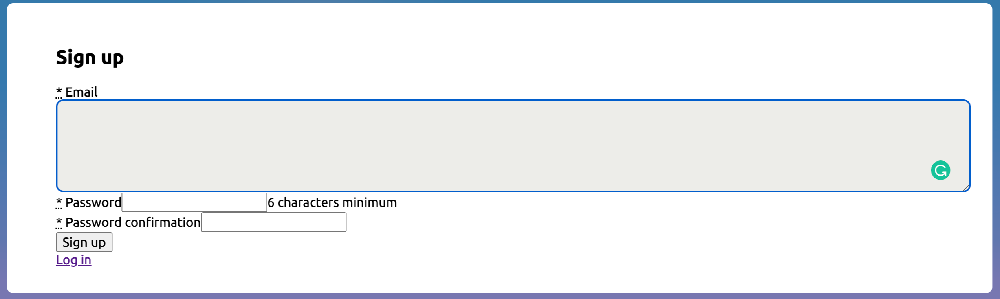
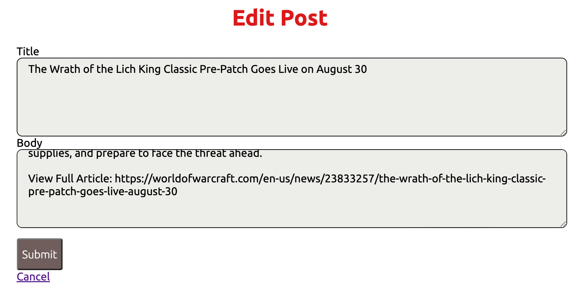
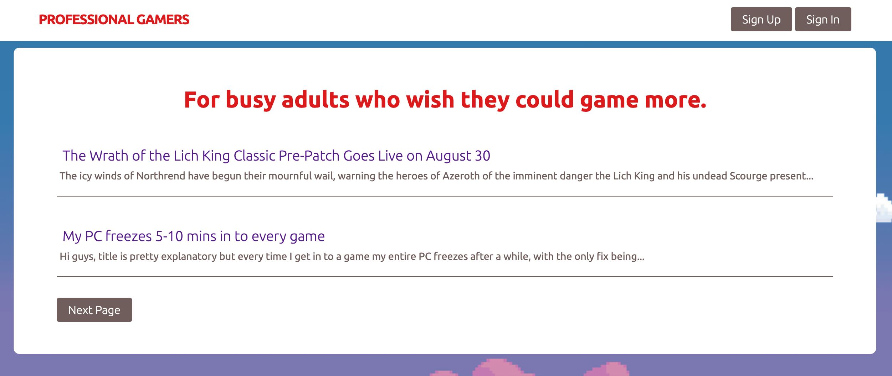
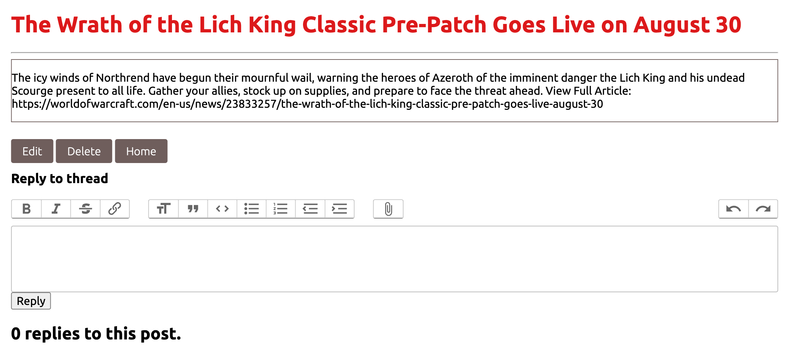

# Professiona Gamers README

Professional Gamers is a place where professionals/parents with little time for the favorite hobby can share their gaming sessions for everyone's benefit.

## Technologies Used

- Ruby v3.1.2 
- CSS/A Framework of some kind 
- HAML 
- Rails v7.0.3.1 

## Screenshots

## Getting started
[Live Link](https://professional-gamers.herokuapp.com)
## Future Enhancements
I want to add the action_text gem to the Post's body content as shown in Comments.xw
Mobile optimization.
Better CSS on the background Clouds.
## Known Issues
"Next Page" pagination moves into infinitum.
On Chrome a Page refresh pushes conent off the screen.
Images don't render in the rich text of Comments.

